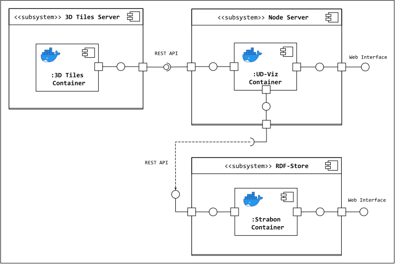

# UD-Demo-Graph-SPARQL

A demonstration of the visualizing RDF semantic graphs alongside 3D City models using UD-Viz, 3D Tiles Server, Strabon RDF Store, and PostGIS.

Documentation for the SPARQL module of UD-Viz can be found [here](https://github.com/VCityTeam/UD-Viz/tree/master/src/Widgets/Extensions/SPARQL).

### Component Diagram


## Installation
### Pre-requisites 

* [Install Docker](https://docs.docker.com/engine/install/)
* [Install Docker Compose](https://docs.docker.com/compose/install/)
* Install Python 3
  * [Windows](https://www.python.org/downloads/)
  * Ubuntu:
    ```
    sudo apt update
    sudo apt install python3
    ```

### Component Setup
To configure the demo and the components that support it edit the `.env` file to be launched with docker-compose. By default the following ports are used by the following services:
- 8995: `3dtiles-server`
- 8996: `PostGIS`
- 8997: `Strabon`
- 8998: `UD-Viz`

If other ports are declared in the `.env` for `3dtiles-server` or `Strabon` make sure to also update them in the `./UD-Viz/config.json` file before building their respective docker images.

The following sections will describe how to configure this file for each component. 

### Build Images
In order to serve the 3D Tiles dataset to be used in the demo (located [here](./data/)) to UD-Viz, first the files must be loaded into the docker image.

To do this, run the `servelocalfiles.py` script to expose the data files locally on `localhost:8080`:
```
python3 servelocalfiles.py
```
Next build the 3D Tiles Server, Strabon, and UD-Viz docker images:
```
docker-compose build
```
When complete, halt the `servelocalfiles.py` script with `Ctrl+c`.

Once the images are built initialize their containers:
```
docker-compose up
```

### Upload RDF-Store Dataset
For the SPARQL module to function an RDF dataset must be uploaded to Strabon. To do this:
1. Open a web browser and navigate to `localhost:8997/strabon`
2. From the left menu, click *Explore/Modify operations* then *Configuration*
3. Enter the configuration for **PostGIS** as declared in the `.env` configuration file then click *Connect*
   * You may also be asked to enter administrative credentials for Strabon. In this case the username and password are declared in the `.env` as well
4. From the left menu, click *Explore/Modify operations* then *Store*
5. Set the *RDF Format* dropdown to `RDF/XML`
6. Copy and paste the first RDF dataset, located here `[./data/LYON_1ER_BATI_2015-20_bldg-patched1](./data/LYON_1ER_BATI_2015-20_bldg-patched1)` into the *Direct Input* field
7. Click *Store Input* and repeat steps 6-7 for the remaining RDF datasets

Now the demo is ready and can be accessed from `localhost:8998`

## Known Issues
- The connection between the Strabon and PostGIS is known to break upon restarting their containers. To fix this, with all containers stopped, delete the Strabon container and restart the service with docker-compose:
```
docker rm ud-demo-graph-sparql_strabon_1
```