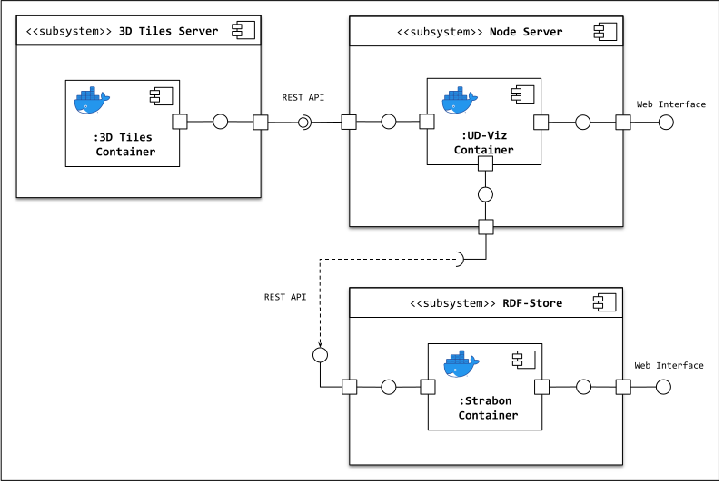

# UD-Demo-Graph-SPARQL

[](https://app.travis-ci.com/github/VCityTeam/UD-Demo-Graph-SPARQL)

A template repository for creating demos for visualizing RDF semantic graphs alongside 3D City models using:
* [UD-Viz](https://github.com/VCityTeam/UD-Viz) as a frontend web application for urban data visualization
  * In particular the [SPARQL module](https://github.com/VCityTeam/UD-Viz/tree/master/src/Widgets/Extensions/SPARQL) is used to visualize semantic urban data in the form of RDF
* And some RDF store as a backend. Currently two options are supported:
  * [Blazegraph](https://blazegraph.com/), a ultra-high-performance graph database supporting Blueprints and RDF/SPARQL APIs

### Component Diagram


## Installation

### Pre-requisites 

* [Install Docker](https://docs.docker.com/engine/install/)
* [Install Docker Compose](https://docs.docker.com/compose/install/)

### Repository setup
To begin create a new Github repository using this template:


Once generated, use the new repository can be cloned:
```
git clone [your new repository URL]
```

### Component Setup
To configure the demo and the components that support it edit the `.env` file to be launched with docker-compose. By default, the following ports are used by the following services:
```bash
#### UD-Viz
UD_VIZ_PORT=8000
#### BlazeGraph
BLAZEGRAPH_PORT=8001
```
The following sections will describe how to configure this file for each component. 

### Build Images and run containers
First, build the docker images and run their containers:
```bash
docker compose up
```
> [!NOTE]
> Make sure to set the `sparqlModule/url` port in the `./ud-viz-context/config.json` file to the same port for the triple store container declared in the `.env` file.
> If these ports are ever changed after building the images, the _UD-Viz_ image must be rebuilt:
> ```bash
> docker compose stop udviz
> docker compose build udviz
> docker compose up udviz
> ```

### Upload RDF-Store Dataset
It is recommended to upload files automatically using the [Blazegraph REST API](https://github.com/blazegraph/database/wiki/REST_API)

For example, to upload an online RDF file into Blazegraph use the following command:
```bash
curl -X POST --data-binary 'uri=https://dataset-dl.liris.cnrs.fr/rdf-owl-urban-data-ontologies/Datasets/GratteCiel_Workspace_2009_2018/3.0/GratteCiel_2009_2018_Workspace.rdf' 'http://127.0.0.1:9011/blazegraph/sparql'
```

Now the UD-Viz demo is ready and can be accessed from [localhost:8000](http://localhost:8000)
The Blazegraph interface can also be accessed from [localhost:8001](http://localhost:8001)
