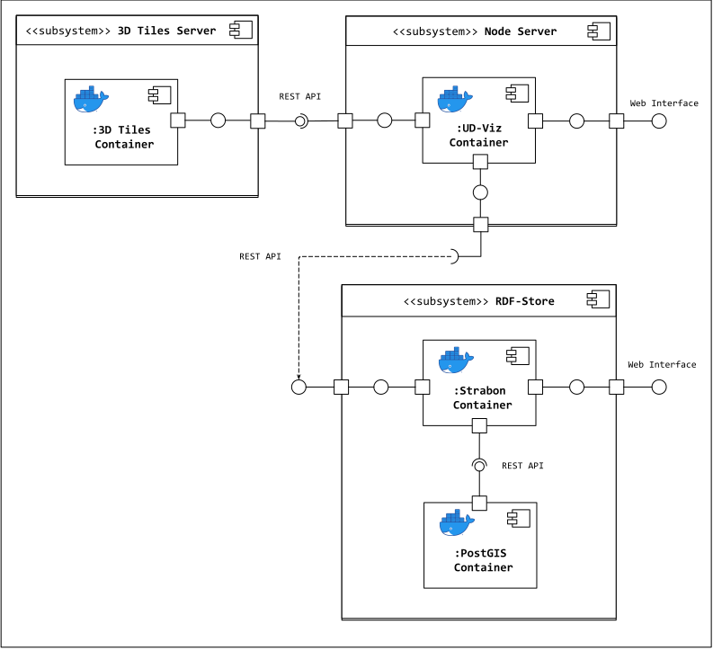

# UD-Demo-Graph-SPARQL

A demonstration for visualizing RDF semantic graphs alongside 3D City models using:
* [UD-Viz](https://github.com/VCityTeam/UD-Viz) as a frontend web application for urban data visualization
  * In particular the [SPARQL module](https://github.com/VCityTeam/UD-Viz/tree/master/src/Widgets/Extensions/SPARQL) is used to visualize semantic urban data in the form of RDF
* [3D Tiles Server](https://github.com/CesiumGS/3d-tiles-samples) to serve 3D Tiles datasets
* [Strabon RDF Store](http://www.strabon.di.uoa.gr/) an RDF-Store for storing and serving geospatial semantic graph data in the form of RDF
* [PostGIS](https://postgis.net/) a geospatial database extension of [PostgreSQL](https://www.postgresql.org/) used here as a backend database for Strabon

### Component Diagram


## Installation
### Pre-requisites 

* [Install Docker](https://docs.docker.com/engine/install/)
* [Install Docker Compose](https://docs.docker.com/compose/install/)
* Install Python 3
  * [Windows](https://www.python.org/downloads/)
  * Ubuntu:
    ```
    sudo apt update
    sudo apt install python3
    ```

### Component Setup
To configure the demo and the components that support it edit the `.env` file to be launched with docker-compose. By default the following ports are used by the following services:
- 8996: `PostGIS`
- 8997: `Strabon`
- 8998: `UD-Viz`

**Note:** If changing ports declared in the `.env` file `Strabon` make sure to also update them in the `./ud-viz-context/config.json` file and rebuild any existing UD-Viz docker images and containers.

The following sections will describe how to configure this file for each component. 

### Build Images and run containers
First, build the PostGIS, Strabon, and UD-Viz docker images and run their containers:
```
docker-compose build
docker-compose up
```

### Upload RDF-Store Dataset
For the SPARQL module to function an RDF dataset must be uploaded to Strabon. To do this:
1. Open a web browser and navigate to `localhost:8997/strabon`
2. From the left menu, click *Explore/Modify operations* then *Configuration*
3. Enter the configuration for **PostGIS** as declared in the `.env` configuration file then click *Connect*
   * You may also be asked to enter administrative credentials for Strabon. In this case the username and password are declared in the `.env` as well
4. From the left menu, click *Explore/Modify operations* then *Store*
5. Set the *RDF Format* dropdown to `RDF/XML`
6. Copy and paste the first RDF dataset, located here [`./data/LYON_1ER_BATI_2015-20_bldg-patched1`](./data/LYON_1ER_BATI_2015-20_bldg-patched1) into the *Direct Input* field and click *Store Input*
7. Repeat step 6 for the remaining RDF datasets

Now the demo is ready and can be accessed from `localhost:8998`

## Known Issues
- The connection between the Strabon and PostGIS is known to break upon restarting their containers. To fix this, stop all demo containers, delete the Strabon container, and restart the service with docker-compose:
```
docker stop ud-demo-graph-sparql_postgis_1 ud-demo-graph-sparql_strabon_1 ud-demo-graph-sparql_udviz_1
docker rm ud-demo-graph-sparql_strabon_1
docker-compose up
```
- The Strabon administrative credentials cannot be changed from the `.env` file. See issue [#1](https://github.com/VCityTeam/UD-Demo-Graph-SPARQL/issues/1).